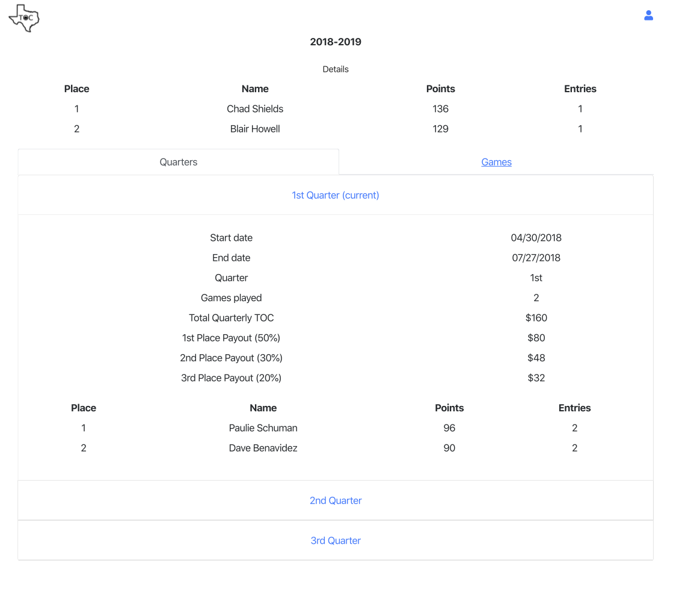
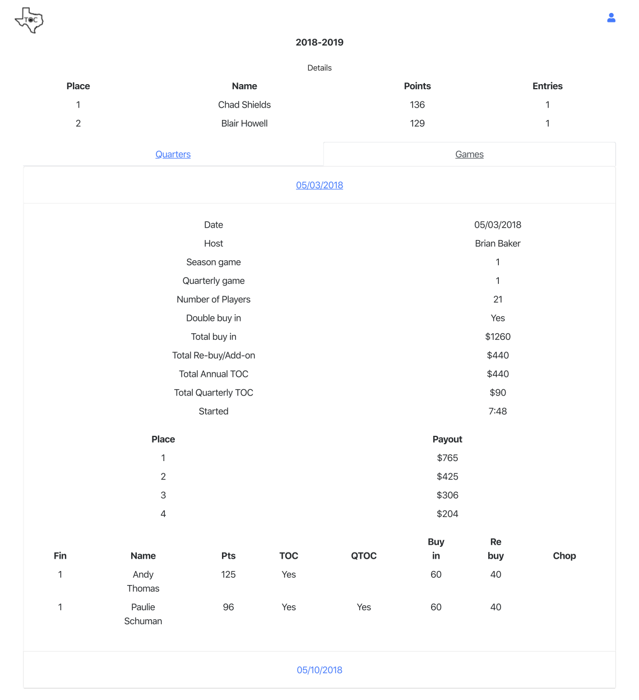

# poker-league-season (react/redux) 

I am rewriting my poker league application from core Spring 3.x and JQuery mobile to Spring Boot and React/Redux.

This is the beginning of writing a new front end using React and Redux.

This application will show the season view.

The following shows what I did step by step.

Each step can be found on the cooresponding branch.

## step 04 details
Fleshed out the details react component using static data.

## step 03 bootstrap
Oh yeah, it's nice to add Bootstrap to the app for two reasons:

It looks nice. Nice buttons, tables, rows and columns, ...
Functionality - accordions, modal dialogs, ...
React Bootstrap can be found at https://react-bootstrap.github.io/
* npm install --save react-bootstrap bootstrap

Always need lodash
* npm install --save lodash

Now have a tab for quarters and a tab for games.

## step 02 screen layout
**Note:** Leaving out the git commands from this step on.

The current season shows not only the season details but also has two
sub-tabs: one for the quarters of the season and one for the games of 
the season.

A simplified mock up showing the season with the quarterly tab

The same mock up showing the season with the games tab

#### Presentation (react) components
* Details
* Quaters
* Games

Created the skelton for the react components for the bulleted items above.
Changed the main App to include the new react components.

## step 01 create development environment
To get started did the following.

From https://reactjs.org/docs/create-a-new-react-app.html#create-react-app

* _npx create-react-app poker-league-season_
* _cd poker-league-season_

Removed the .git directory
* _rm -rf .git_

Created github repository poker-league-current-game
Hooked up react-redux-tutorial with the github repository

* _git init_
* _git add ._
* _git commit -m "initial commit"_
* _git remote add origin https://github.com/gpratte/poker-league-season.git_
* _git push origin master_

Make sure the initial react application works. Run
* _npm start_

should see the default react page in the web browser at http://localhost:3000/

From the redux tutorial "Usage with React" https://redux.js.org/basics/usage-with-react install react-redux
* _npm install --save react-redux_

Push changes to a branch
* _git checkout -b step-01-create-development-environment_
* _git add ._
* _git commit -m "added react-redux npm package"_
* _git push origin step-01-create-development-environment_

Update README.md with the text you are reading :)
* _git add ._
* _git commit -m "update readme"_
* _git push origin step-01-create-development-environment_

Push to master
* _git checkout master_
* _git merge step-01-create-development-environment_
* _git push origin master_